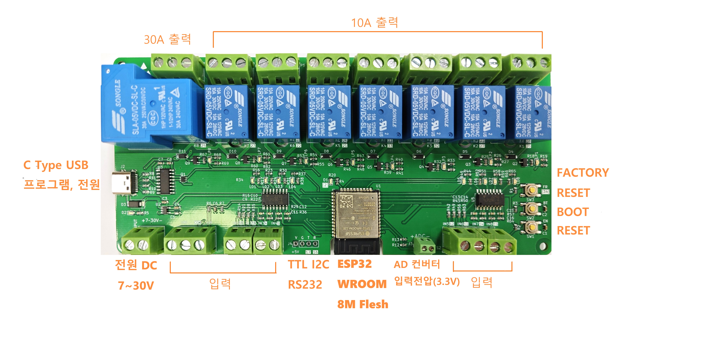

# i2r-04 IoT PLC
WiFi Bluetooth PLC (4채널 릴레이, , ESP32) KC인증  
인터넷 환경에서 원격으로 모니터링/제어 할수 있는 PLC 입니다.  


📌 사양
- 정격전압 : 5V DC, 보드내에서는 5V로 설계했습니다.
- 입력전압 : 7 ~ 26V DC Free Volt, 7 ~ 26V 사이 전압을 공급하면         레귤레이터에서 5V 로 전원을 공급합니다.
- 작동온도 : -40 ℃ - 85 ℃
- 입력 : 8개, 접점만 연결되면 동작합니다. 별도의 전압을 인가하면 고장의 원인이 됩니다.
- 출력 : 1개는 30A 250VAC/30VDC
7개는 10A VAC, 10A VDC, 10A 125VAC, 10A 28VDC
- 통신: WIFI 802.11 b / g / n (802.11n에서 최대 150Mbps) 및 Bluetooth 4.2 BR / EDR + BLE
와이파이는 2.4G에 연결하세요. 5G는 동작하지 않습니다.
- RS232 통신 : 보드내에 TTL Level의 rx, tx 단자가 있습니다.

스마트폰에 어플 설치와 와이파이 연결을 보여줍니다. 그림을 크릭하세요  
[아두이노 소스프로그램 링크](https://github.com/kdi6033/i2r-04/tree/main/0%20Source-Program-IoT/board-i2r-04)  
[AWS 아두이노 소스프로그램 링크](https://github.com/kdi6033/i2r-04/tree/main/0%20Source-Program-IoT/board-i2r-04-aws)  
[](https://youtu.be/FT0muFM24xc)
 1) 8채널 릴레이  
8채널 릴레이가 탑재된 보드입니다. 릴레이 출력단에 A접점을 활용해 장치를 연결할 수 있습니다.
다양한 장치를 연결해서 손쉽게 원격제어 시스템을 구현해보세요. 모든 소스프로그램은 설명글 하단을 참조하세요.
릴레이에 연결된 ESP32핀은 왼쪽부터 각각 <br>
출력 : 25 23 22 21 33 32 27 26  <br>
입력 : 18 19 4 5 21 22 23 15

1) WiFi, BLE 통신  
ESP32가 탑재되어 WiFi, BLE 통신 가능합니다. WiFi 를 활용해 PC 및 스마트폰에서 4채널 릴레이를
원격제어 및 모니터링 가능합니다. 
BLE 를 활용해 근거리 제어가 가능합니다. IoT와 관련해 다양하게 활용 가능합니다.

# AD 컨버터 입력전압 측정
보드의 34, 35 핀에 AD콘버터가 있어서 전압을 측정할수 있습니다. 이를 측정하는 프로그램 설명 영상입니다.<br>
[아두이노 소스프로그램 링크](https://github.com/kdi6033/i2r-04/blob/main/2%20volt%20value/voltValue/voltValue.ino)  
[](https://www.youtube.com/watch?v=lZQ763ljGjE)

# MQTT 통신 연결하기
아두이노로 mqtt 통신을 연결한다.
ArduinoJson.h 를 사용해 데이터 처리방법을 설명한다.
IoT MQTT Panel을 이용해 스마트폰으로 보드의 Relay를 제어 한다.
이 프로그램을 이용해 인터넷 상에서 원격으로 입력i과 출력을 제어 할 수 있습니다.
[](https://youtu.be/u4NejCu5xnw)

# i2r-04-motor IoT 모터제어

    

### 📺 시연 영상 (IoT PLC 모터제어)
<a href="https://youtu.be/1kaBq4O8o8E">
  
</a>

### 📺 시연 영상 (IoT PLC 한글터치판넬 와이파이정보 입력)
<a href="https://youtu.be/eMnKAh1EjlE">
  
</a>

## 1. (주)우성하이텍 WSM-4035 모터 제어

📌 제품 개요
WSM-4035는 환기창(루버, 온실, 축사 등)의 개폐 제어를 위해 사용되는 DC24V 구동 모터입니다.
헤리컬 & 유성 기어를 통한 감속 방식을 적용하여 높은 내구성과 안정성을 제공하며, LED 표시등을 통해 동작 상태를 확인할 수 있습니다.
본 프로젝트에서는 ESP32 기반 IoT 제어 보드와 MQTT 통신을 활용하여 WSM-4035 모터를 원격 제어할 수 있도록 구현하였습니다.

⚙️ 주요 사양 (WSM-4035 기준)
| 구분            | 사양                |
| ------------- | ----------------- |
| **정격 전압**     | DC 24V            |
| **안전 사용 전류**  | 2.6A              |
| **회전수**       | 3.5 rpm           |
| **토크**        | 4 Kg·m            |
| **최대 전류**     | 3.5A              |
| **최대 회전수**    | 3.3 rpm           |
| **최대 토크**     | 6 Kg·m            |
| **리미트 설정 범위** | 35                |
| **본체 무게**     | 2.4 kg            |
| **감속 방식**     | 헤리컬 & 유성기어        |
| **작동 표시**     | 2컬러 LED (적색/녹색)   |
| **기본 제공 부품**  | ①②③④⑤⑥ (제공 그림 참조) |

🔧 리미트 스위치 설정 방법 (WSM-4035 기준)
WSM 시리즈 모터(4035 포함)는 **내부에 리미트 스위치(limit switch)**가 내장되어 있어서, 사용자가 원하는 개폐 위치에서 리미트 나사를 돌려 설정할 수 있습니다.
1. 전원 차단
- 반드시 DC24V 전원을 끈 상태에서 작업하세요.
2.모터 구동 → 원하는 위치까지 이동
- 환기창(루버)을 열고/닫아 원하는 위치까지 움직입니다.
3. 리미트 스위치 조정 나사 확인
- 모터 본체 측면 또는 기어박스 커버 안쪽에 **리미트 조정 나사(2개)**가 있습니다.
- 하나는 열림(OPEN) 위치, 다른 하나는 닫힘(CLOSE) 위치를 담당합니다.
4. 리미트 나사 돌려 설정
- 드라이버로 나사를 돌려서 원하는 위치에서 멈추도록 설정합니다.
- ↻ 시계 방향: 동작 범위를 좁힘
- ↺ 반시계 방향: 동작 범위를 넓힘
5. 테스트
- 전원을 다시 넣고 열림/닫힘 동작을 반복하여 정확히 원하는 지점에서 멈추는지 확인합니다.

📌 회로도    
다음과 같이 배선하세요 총 4개의 모터를 제어 할 수 있습니다.    


## 2. CrowPanel Pico Display 3.5" HMI 모듈


[📌 판넬 사양은 다음 링크를 참조하세요](https://github.com/kdi6033/i2r#crowpanel-pico-display-35-hmi-%EB%AA%A8%EB%93%88)

[📥 i2r-04-motor 보드 HMI 프로그램 다운로드](https://github.com/kdi6033/download/raw/main/i2r04/hmi-i2r04-motor.zip)

이 보드는 RP2040 MCU + 3.5" 480×320 TFT LCD + 정전식 터치스크린이 결합된 HMI(Human Machine Interface) 모듈입니다. LVGL, C/C++, MicroPython을 지원하여 다양한 UI 및 IoT 응용에 활용할 수 있습니다.


📌 주요 기능
- RP2040 듀얼코어 MCU 내장 → 외부 보드 없이 단독 동작 가능
- 3.5인치 480×320 해상도 TFT 디스플레이 → 선명한 그래픽 표현
- 정전식 터치스크린 → 직관적인 UI 제어 가능
- LVGL 지원 → 버튼, 슬라이더, 차트, 키보드 등 고급 GUI 구성
- USB-C 포트 → 전원 공급 및 펌웨어 업로드 지원
- C/C++ & MicroPython 개발 환경 → 초보자부터 전문가까지 사용 가능
- GPIO 확장 핀 제공 → 센서, 액추에이터 등 외부 장치 연결 가능
- HMI 전용 설계 → IoT, 스마트 제어, 교육용 UI 개발에 최적화

⚙️GPIO Pin Definition

| Pin | Function       | Pin | Function               |
| --- | -------------- | --- | ---------------------- |
| P1  | GP0 / UART0 TX | P9  | GP19                   |
| P2  | GP1 / UART0 RX | P10 | GP20 / I2C0 SDA        |
| P3  | GP2 / I2C1 SDA | P11 | GP21 / I2C0 SCL        |
| P4  | GP3 / I2C1 SCL | P12 | GP26 / ADC1 / I2C1 SDA |
| P5  | GP4 / UART1 TX | P13 | GP27 / ADC0 / I2C1 SCL |
| P6  | GP5 / UART1 TX | P14 | GP28 / ADC2            |
| P7  | GP6 / I2C1 SDA | P15 | GND                    |
| P8  | GP7 / I2C1 SCL | P16 | VCC 3V3                |

<br>     
<details>
    <summary>💻 HMI 터치판넬 프로그램</summary>

```c
// ✅ HMI 터치판넬 프로그램
//원본 2025.11.27
//on 연두색 0x32CD32 : off 회색 0xC0C0C0
#include <lvgl.h>
#include <TFT_eSPI.h>
#include <Wire.h>
#include <ArduinoJson.h>
#include <BH1750.h>
#include "lv_qrcode.hpp"
#include "qrcodegen.hpp"
#include "NotoSansKR_20.h"

#define SCREEN_WIDTH 480
#define SCREEN_HEIGHT 320

// ★ 추가: on/off 공통 색상 매크로
#define onColor  lv_color_hex(0x32CD32)
#define offColor lv_color_hex(0xC0C0C0)

TFT_eSPI tft = TFT_eSPI();
static lv_disp_draw_buf_t draw_buf;
static lv_color_t buf1[SCREEN_WIDTH * SCREEN_HEIGHT / 10];

lv_obj_t* btn[8];
bool btnState[8] = {false};
lv_obj_t* lightLabel;
String serialBuffer = "";
// ★ 추가: 입력 상태 LED 8개
lv_obj_t* in_led[8] = {nullptr};

BH1750 lightMeter;
unsigned long lastLightSendTime = 0;

lv_obj_t* ssid_ta;
lv_obj_t* pw_ta;
lv_obj_t* email_ta;
lv_obj_t* connect_btn;  // ✅ 전역 선언
lv_obj_t* mqtt_ta;      // ✅ mqtt 입력도 전역 선언 가능
lv_obj_t* tab2; // ✅ 전역으로 이동
lv_obj_t* tab3; // 사용자 메뉴얼 탭
lv_obj_t* manual_btn;  // "사용법 보기" 버튼
lv_obj_t* qr_panel;    // QR 패널
lv_obj_t* bt_btn;   // ✅ 블루투스 버튼
lv_obj_t* fw_btn;   // ✅ 펌웨어 다운로드 버튼

lv_obj_t* wifi_icon;  // 와이파이 아이콘을 전역으로 선언
lv_obj_t* mqtt_icon; 

static inline void send_bleboot() {
  JsonDocument doc;
  doc["c"] = "ti";
  doc["bleboot"] = 1;
  String json;
  serializeJson(doc, json);
  Serial1.println(json);
  Serial.println("[SEND] " + json);
}

// ✅ 입력 LED 색상 변경 함수
void updateInputLED(uint8_t index, bool state) {
  if (index >= 8) return;
  if (!in_led[index]) return;

  lv_obj_set_style_bg_color(in_led[index], state ? onColor : offColor, LV_PART_MAIN);
}

void my_disp_flush(lv_disp_drv_t* disp, const lv_area_t* area, lv_color_t* color_p) {
  uint32_t w = area->x2 - area->x1 + 1;
  uint32_t h = area->y2 - area->y1 + 1;
  tft.startWrite();
  tft.setAddrWindow(area->x1, area->y1, w, h);
  tft.pushColors((uint16_t*)&color_p->full, w * h, true);
  tft.endWrite();
  lv_disp_flush_ready(disp);
}

uint16_t touchX, touchY;
void my_touchpad_read(lv_indev_drv_t* indev_driver, lv_indev_data_t* data) {
  bool touched = tft.getTouch(&touchX, &touchY, 600);
  data->state = touched ? LV_INDEV_STATE_PR : LV_INDEV_STATE_REL;
  if (touched) {
    data->point.x = touchX;
    data->point.y = touchY;
  }
}

void sendToggleCommand(uint8_t btnIndex, bool state) {
  JsonDocument doc;
  doc["c"] = "so";
  doc["n"] = btnIndex;
  doc["v"] = state ? 1 : 0;  // ✅ 0과 1로 명시적으로 전송
  String json;
  serializeJson(doc, json);
  Serial1.println(json);
  Serial.println("[SEND] " + json);
}

void updateButtonUI(uint8_t index, bool state) {
  lv_obj_set_style_bg_color(btn[index], state ? onColor : offColor, LV_PART_MAIN);
  lv_label_set_text(lv_obj_get_child(btn[index], 0), state ? "ON" : "OFF");
  lv_obj_center(lv_obj_get_child(btn[index], 0));
}

void btn_event_cb(lv_event_t* e) {
  uint8_t index = (uint32_t)lv_event_get_user_data(e);
  uint8_t other = (index % 2 == 0) ? index + 1 : index - 1;
  btnState[index] = !btnState[index];
  updateButtonUI(index, btnState[index]);
  sendToggleCommand(index, btnState[index]);
  if (btnState[index] && btnState[other]) {
    btnState[other] = false;
    updateButtonUI(other, false);
    sendToggleCommand(other, false);
  }
}

void add_footer_label(lv_obj_t* parent) {
  lv_obj_t* footer = lv_label_create(parent);
  lv_label_set_text(footer, "아이티알   http://i2r.link");
  lv_obj_set_style_text_font(footer, &NotoSansKR_20, LV_PART_MAIN);
  lv_obj_set_style_text_color(footer, lv_color_hex(0xF37A2D), LV_PART_MAIN);
  lv_obj_align(footer, LV_ALIGN_BOTTOM_RIGHT, -10, -10);
}

void create_tabs() {
  lv_obj_t* tabview = lv_tabview_create(lv_scr_act(), LV_DIR_TOP, 50);
  lv_obj_set_style_text_font(lv_tabview_get_tab_btns(tabview), &NotoSansKR_20, LV_PART_MAIN);
  lv_obj_t* tab1 = lv_tabview_add_tab(tabview, "모터제어");
  tab2 = lv_tabview_add_tab(tabview, "크라우드연결");
  tab3 = lv_tabview_add_tab(tabview, "사용자 메뉴얼");
  //lv_obj_t* tab3 = lv_tabview_add_tab(tabview, "사용자 메뉴얼");

  // tab1 프로그램  ============================================================
  // ✅ 8개의 입력 LED 한 줄로 배치 
  lv_obj_t* led_row = lv_obj_create(tab1);
  lv_obj_set_size(led_row, 500, 60);
  lv_obj_align(led_row, LV_ALIGN_TOP_MID, 40, -20);   // 화면 위쪽에 배치
  lv_obj_set_flex_flow(led_row, LV_FLEX_FLOW_ROW);
  lv_obj_set_style_bg_opa(led_row, LV_OPA_TRANSP, 0);
  lv_obj_set_style_border_width(led_row, 0, 0);
  lv_obj_set_style_pad_gap(led_row, 14, 0);

  for (int i = 0; i < 8; i++) {
    in_led[i] = lv_btn_create(led_row);                 // LED 하나 생성 (버튼 기반)
    lv_obj_set_size(in_led[i], 36, 36);                 // 🔹 LED 크기: 36x36 (원형)
    lv_obj_set_style_radius(in_led[i], LV_RADIUS_CIRCLE, LV_PART_MAIN); // 원형
    lv_obj_clear_flag(in_led[i], LV_OBJ_FLAG_CLICKABLE);                // 클릭 불가

    // 기본 색상: offColor (회색)
    lv_obj_set_style_bg_color(in_led[i], offColor, LV_PART_MAIN);

    // 안에 숫자 1~8 표시
    lv_obj_t* led_label = lv_label_create(in_led[i]);
    char num[3];
    snprintf(num, sizeof(num), "%d", i + 1);
    lv_label_set_text(led_label, num);
    lv_obj_center(led_label);
  }

  // ✅ 8개의 버튼 배치 
  for (int i = 0; i < 8; i++) {
    btn[i] = lv_btn_create(tab1);
    lv_obj_set_size(btn[i], 100, 60);
    int pairIndex = i / 2;
    int xOffset = -5 + pairIndex * 120;
    //int yOffset = (i % 2 == 0) ? -65 : 25;
    int yOffset = (i % 2 == 0) ? -45 : 40;
    lv_obj_align(btn[i], LV_ALIGN_LEFT_MID, xOffset, yOffset);
    lv_obj_add_event_cb(btn[i], btn_event_cb, LV_EVENT_CLICKED, (void*)(uintptr_t)i);
    lv_obj_set_style_bg_color(btn[i], offColor, LV_PART_MAIN);
    lv_obj_t* label = lv_label_create(btn[i]);
    lv_label_set_text(label, "OFF");
    lv_obj_center(label);
  }

  lightLabel = lv_label_create(tab1);
  lv_label_set_text(lightLabel, "조도 -- ");
  lv_obj_set_style_text_font(lightLabel, &NotoSansKR_20, LV_PART_MAIN);
  lv_obj_set_style_text_color(lightLabel, lv_color_hex(0x007FFF), LV_PART_MAIN);
  lv_obj_align(lightLabel, LV_ALIGN_BOTTOM_LEFT, 170, -10);

  // 와이파이 아이콘 추가
  wifi_icon = lv_label_create(tab1);
  lv_label_set_text(wifi_icon, LV_SYMBOL_WIFI);  // 와이파이 아이콘 lvgl 내장 아이콘
  lv_obj_set_style_text_font(wifi_icon, &lv_font_montserrat_20, LV_PART_MAIN); 
  lv_obj_set_style_text_color(wifi_icon, lv_color_hex(0xFF0000), LV_PART_MAIN);  // 연두색으로 설정
  lv_obj_align(wifi_icon, LV_ALIGN_BOTTOM_LEFT, 20, -10);  // 아이콘 위치 조정

  //mqtt 아이콘
  mqtt_icon = lv_label_create(tab1);
  lv_label_set_text(mqtt_icon, LV_SYMBOL_REFRESH);  // 연결 아이콘
  lv_obj_set_style_text_font(mqtt_icon, &lv_font_montserrat_20, LV_PART_MAIN);  // 폰트 설정
  lv_obj_set_style_text_color(mqtt_icon, lv_color_hex(0xFF0000), LV_PART_MAIN); 
  lv_obj_align(mqtt_icon, LV_ALIGN_BOTTOM_LEFT, 70, -10);  // 아이콘 위치 조정

  //add_footer_label(tab1);

  // tab2 프로그램  ============================================================================
  lv_obj_set_style_bg_color(tab2, lv_color_black(), LV_PART_MAIN);
  lv_obj_t* label2 = lv_label_create(tab2);
  lv_label_set_text(label2, "다음 정보를 입력하세요");
  lv_obj_set_style_text_font(label2, &NotoSansKR_20, LV_PART_MAIN);
  lv_obj_set_style_text_color(label2, lv_color_hex(0xA0A0A0), LV_PART_MAIN);
  lv_obj_align(label2, LV_ALIGN_TOP_MID, 0, 95);

  // ░▒▓ 박스 1: 와이파이 정보 ▓▒░
  lv_obj_t* wifi_row = lv_obj_create(tab2);
  lv_obj_set_size(wifi_row, 450, 100);
  lv_obj_set_pos(wifi_row, 10, -20);
  lv_obj_set_flex_flow(wifi_row, LV_FLEX_FLOW_ROW);
  lv_obj_set_style_bg_opa(wifi_row, LV_OPA_TRANSP, 0);
  lv_obj_set_style_border_width(wifi_row, 0, 0);
  lv_obj_set_style_pad_gap(wifi_row, 10, 0);

  ssid_ta = lv_textarea_create(wifi_row);
  lv_obj_set_width(ssid_ta, 200);
  lv_textarea_set_one_line(ssid_ta, true);
  lv_textarea_set_placeholder_text(ssid_ta, "와이파이 이름");
  lv_obj_set_style_text_font(ssid_ta, &NotoSansKR_20, LV_PART_MAIN);

  pw_ta = lv_textarea_create(wifi_row);
  lv_obj_set_width(pw_ta, 200);
  lv_textarea_set_one_line(pw_ta, true);
  lv_textarea_set_password_mode(pw_ta, true);
  lv_textarea_set_placeholder_text(pw_ta, "와이파이 비밀번호");
  lv_obj_set_style_text_font(pw_ta, &NotoSansKR_20, LV_PART_MAIN);

  // ░▒▓ 박스 2: 이메일 + MQTT ▓▒░
  lv_obj_t* email_row = lv_obj_create(tab2);
  lv_obj_set_size(email_row, 450, 60);
  lv_obj_set_pos(email_row, 10, 30);
  lv_obj_set_flex_flow(email_row, LV_FLEX_FLOW_ROW);
  lv_obj_set_style_bg_opa(email_row, LV_OPA_TRANSP, 0);
  lv_obj_set_style_border_width(email_row, 0, 0);
  lv_obj_set_style_pad_gap(email_row, 10, 0);

  email_ta = lv_textarea_create(email_row);
  lv_obj_set_width(email_ta, 200);
  lv_textarea_set_one_line(email_ta, true);
  lv_textarea_set_placeholder_text(email_ta, "이메일");
  lv_obj_set_style_text_font(email_ta, &NotoSansKR_20, LV_PART_MAIN);

  mqtt_ta = lv_textarea_create(email_row);
  lv_obj_set_width(mqtt_ta, 200);
  lv_textarea_set_one_line(mqtt_ta, true);
  lv_textarea_set_placeholder_text(mqtt_ta, "MQTT 주소");
  lv_textarea_set_text(mqtt_ta, "mqtt.i2r.link");  // ✅ 기본값 설정
  lv_obj_set_style_text_font(mqtt_ta, &NotoSansKR_20, LV_PART_MAIN);

  // 키보드
  lv_obj_t* kb = lv_keyboard_create(tab2);
  lv_obj_add_flag(kb, LV_OBJ_FLAG_HIDDEN);
  lv_obj_set_size(kb, 480, 120);
  lv_obj_align(kb, LV_ALIGN_BOTTOM_MID, 0, 0);

  // 키보드 이벤트
  auto kb_event_cb = [](lv_event_t* e) {
    lv_event_code_t code = lv_event_get_code(e);
    lv_obj_t* ta = lv_event_get_target(e);
    lv_obj_t* kb = (lv_obj_t*)lv_event_get_user_data(e);
    if (code == LV_EVENT_FOCUSED || code == LV_EVENT_CLICKED) {
      lv_keyboard_set_textarea(kb, ta);
      lv_obj_clear_flag(kb, LV_OBJ_FLAG_HIDDEN);
      lv_obj_add_flag(connect_btn, LV_OBJ_FLAG_HIDDEN);  // ✅ 버튼 숨김
    }
  };

  lv_obj_add_event_cb(ssid_ta, kb_event_cb, LV_EVENT_ALL, kb);
  lv_obj_add_event_cb(pw_ta, kb_event_cb, LV_EVENT_ALL, kb);
  lv_obj_add_event_cb(email_ta, kb_event_cb, LV_EVENT_ALL, kb);
  lv_obj_add_event_cb(mqtt_ta, kb_event_cb, LV_EVENT_ALL, kb);

  // manual_btn도 숨김 처리
  auto kb_event_cb_with_manual = [](lv_event_t* e) {
    lv_event_code_t code = lv_event_get_code(e);
    lv_obj_t* ta = lv_event_get_target(e);
    lv_obj_t* kb = (lv_obj_t*)lv_event_get_user_data(e);
    if (code == LV_EVENT_FOCUSED || code == LV_EVENT_CLICKED) {
      lv_keyboard_set_textarea(kb, ta);
      lv_obj_clear_flag(kb, LV_OBJ_FLAG_HIDDEN);
      lv_obj_add_flag(connect_btn, LV_OBJ_FLAG_HIDDEN);  // 연결 버튼 숨김
      lv_obj_add_flag(manual_btn, LV_OBJ_FLAG_HIDDEN);   // ✅ 사용법 버튼도 숨김
      if (bt_btn) lv_obj_add_flag(bt_btn, LV_OBJ_FLAG_HIDDEN);   // ✅ 추가
      if (fw_btn) lv_obj_add_flag(fw_btn, LV_OBJ_FLAG_HIDDEN);   // ✅ 추가
    }
  };
  lv_obj_add_event_cb(ssid_ta, kb_event_cb_with_manual, LV_EVENT_ALL, kb);
  lv_obj_add_event_cb(pw_ta, kb_event_cb_with_manual, LV_EVENT_ALL, kb);
  lv_obj_add_event_cb(email_ta, kb_event_cb_with_manual, LV_EVENT_ALL, kb);
  lv_obj_add_event_cb(mqtt_ta, kb_event_cb_with_manual, LV_EVENT_ALL, kb);

  lv_obj_add_event_cb(kb, [](lv_event_t* e) {
    lv_event_code_t code = lv_event_get_code(e);
    lv_obj_t* kb = lv_event_get_target(e);
    if (code == LV_EVENT_CANCEL || code == LV_EVENT_READY) {
      lv_obj_add_flag(kb, LV_OBJ_FLAG_HIDDEN);
      lv_keyboard_set_textarea(kb, NULL);
      lv_obj_clear_flag(connect_btn, LV_OBJ_FLAG_HIDDEN);  // ✅ 버튼 다시 표시
      lv_obj_clear_flag(manual_btn, LV_OBJ_FLAG_HIDDEN);   // ✅ 사용법 버튼도 다시 표시
      if (bt_btn) lv_obj_clear_flag(bt_btn, LV_OBJ_FLAG_HIDDEN); // ✅ 추가
      if (fw_btn) lv_obj_clear_flag(fw_btn, LV_OBJ_FLAG_HIDDEN); // ✅ 추가
    }
  }, LV_EVENT_ALL, NULL);

  // 연결 버튼
  connect_btn = lv_btn_create(tab2);
  lv_obj_set_size(connect_btn, 120, 40);
  lv_obj_align(connect_btn, LV_ALIGN_BOTTOM_MID, 0, -60);
  lv_obj_t* btn_label = lv_label_create(connect_btn);
  lv_label_set_text(btn_label, "연결");
  lv_obj_set_style_text_font(btn_label, &NotoSansKR_20, LV_PART_MAIN);
  lv_obj_center(btn_label);

  lv_obj_add_event_cb(connect_btn, [](lv_event_t* e) {
    const char* email = lv_textarea_get_text(email_ta);
    const char* ssid = lv_textarea_get_text(ssid_ta);
    const char* password = lv_textarea_get_text(pw_ta);
    const char* mqtt = lv_textarea_get_text(mqtt_ta);  // ✅ 추가
    JsonDocument doc;
    doc["c"] = "si";
    doc["e"] = email;
    doc["ssid"] = ssid;
    doc["password"] = password;
    doc["mqttBroker"] = mqtt;  // ✅ 추가
    String json;
    serializeJson(doc, json);
    Serial1.println(json);
    Serial.println("[SEND] " + json);
  }, LV_EVENT_CLICKED, NULL);

  // "사용법 보기" 버튼 추가
  manual_btn = lv_btn_create(tab2);
  lv_obj_set_size(manual_btn, 120, 40);
  lv_obj_align(manual_btn, LV_ALIGN_BOTTOM_MID, -140, -10);  // "연결" 왼쪽에 위치
  lv_obj_t* manual_label = lv_label_create(manual_btn);
  lv_label_set_text(manual_label, "사용법 보기");
  lv_obj_set_style_text_font(manual_label, &NotoSansKR_20, LV_PART_MAIN);
  lv_obj_center(manual_label);

  //"사용법 보기" 버튼 이벤트 연결
  lv_obj_add_event_cb(manual_btn, [](lv_event_t* e) {
    show_qr_panel("https://youtu.be/eMnKAh1EjlE", tab2);  // ✅ 통합 함수 호출
  }, LV_EVENT_CLICKED, NULL);

  // Bluetooth 버튼 (연결 버튼 오른쪽)
  bt_btn = lv_btn_create(tab2);
  lv_obj_set_size(bt_btn, 120, 40);
  lv_obj_align(bt_btn, LV_ALIGN_BOTTOM_MID, 140, -10);  // ✅ 오른쪽에 배치
  lv_obj_t* bt_label = lv_label_create(bt_btn);
  lv_label_set_text(bt_label, "블루투스");
  lv_obj_set_style_text_font(bt_label, &NotoSansKR_20, LV_PART_MAIN);
  lv_obj_center(bt_label);

  // 클릭 시 bleboot 패킷 전송
  lv_obj_add_event_cb(bt_btn, [](lv_event_t* e) {
    send_bleboot();     // ✅ { "c":"ti", "bleboot": 1 } 전송
  }, LV_EVENT_CLICKED, NULL);

  // ⚙️ "Firmware Download" 버튼 (연결 버튼 위에 배치)
  fw_btn = lv_btn_create(tab2);
  lv_obj_set_size(fw_btn, 120, 40);
  lv_obj_align(fw_btn, LV_ALIGN_BOTTOM_MID, 0, -10);  // ✅ "연결"(-10) 위로 50px 정도 위
  lv_obj_t* fw_label = lv_label_create(fw_btn);
  lv_label_set_text(fw_label, "펌웨어설치");
  lv_obj_set_style_text_font(fw_label, &NotoSansKR_20, LV_PART_MAIN);
  lv_obj_center(fw_label);

  // 클릭 시 {"c":"df","f":"i2r-04-motor.ino.bin"} 전송
  lv_obj_add_event_cb(fw_btn, [](lv_event_t* e) {
    JsonDocument doc;
    doc["c"] = "df";
    doc["f"] = "i2r-04-motor.ino.bin";
    String json;
    serializeJson(doc, json);
    Serial1.println(json);
    Serial.println("[SEND] " + json);
  }, LV_EVENT_CLICKED, NULL);

  //tab3 작성  ==========================================================================
  // "크라우드 로그인" 라벨
  lv_obj_t* cloud_link_label = lv_label_create(tab3);
  lv_label_set_text(cloud_link_label, "기기연결, 크라우드 로그인");
  lv_obj_set_style_text_font(cloud_link_label, &NotoSansKR_20, LV_PART_MAIN);
  lv_obj_set_style_text_color(cloud_link_label, lv_color_hex(0x007FFF), LV_PART_MAIN);
  lv_obj_align(cloud_link_label, LV_ALIGN_TOP_LEFT, 0, 10);
  lv_obj_add_flag(cloud_link_label, LV_OBJ_FLAG_CLICKABLE);  // ✅ 이벤트 처리
  // ""기기연결, 크라우드 로그인" 라벨 이벤트
  lv_obj_add_event_cb(cloud_link_label, [](lv_event_t* e) {
    show_qr_panel("https://youtu.be/o17IrUawetg", tab3);
  }, LV_EVENT_CLICKED, NULL);

  // "타이머 설정" 라벨 추가
  lv_obj_t* app_link_label1 = lv_label_create(tab3);
  lv_label_set_text(app_link_label1, "타이머 설정");
  lv_obj_set_style_text_font(app_link_label1, &NotoSansKR_20, LV_PART_MAIN);
  lv_obj_set_style_text_color(app_link_label1, lv_color_hex(0x007FFF), LV_PART_MAIN);
  lv_obj_align(app_link_label1, LV_ALIGN_TOP_LEFT, 0, 50);
  lv_obj_add_flag(app_link_label1, LV_OBJ_FLAG_CLICKABLE);
  // "타이머 설정" Play Store QR 표시
  lv_obj_add_event_cb(app_link_label1, [](lv_event_t* e) {
    show_qr_panel("https://youtu.be/hlbH4OiEDu4", tab3);
  }, LV_EVENT_CLICKED, NULL);

  // "입력 트리거 설정" 라벨 추가
  lv_obj_t* app_link_label2 = lv_label_create(tab3);
  lv_label_set_text(app_link_label2, "입력 트리거 설정");
  lv_obj_set_style_text_font(app_link_label2, &NotoSansKR_20, LV_PART_MAIN);
  lv_obj_set_style_text_color(app_link_label2, lv_color_hex(0x007FFF), LV_PART_MAIN);
  lv_obj_align(app_link_label2, LV_ALIGN_TOP_LEFT, 0, 90);
  lv_obj_add_flag(app_link_label2, LV_OBJ_FLAG_CLICKABLE);
  // "입력 트리거 설정" Play Store QR 표시
  lv_obj_add_event_cb(app_link_label2, [](lv_event_t* e) {
    show_qr_panel("https://youtu.be/e6tqkVcQ8n0", tab3);
  }, LV_EVENT_CLICKED, NULL);

  // "센서 트리거 설정" 라벨 추가
  lv_obj_t* app_link_label3 = lv_label_create(tab3);
  lv_label_set_text(app_link_label3, "센서 트리거 설정");
  lv_obj_set_style_text_font(app_link_label3, &NotoSansKR_20, LV_PART_MAIN);
  lv_obj_set_style_text_color(app_link_label3, lv_color_hex(0x007FFF), LV_PART_MAIN);
  lv_obj_align(app_link_label3, LV_ALIGN_TOP_LEFT, 0, 130);
  lv_obj_add_flag(app_link_label3, LV_OBJ_FLAG_CLICKABLE);
  // "센서 트리거 설정" Play Store QR 표시
  lv_obj_add_event_cb(app_link_label3, [](lv_event_t* e) {
    show_qr_panel("https://youtu.be/hOzujluNKDU", tab3);
  }, LV_EVENT_CLICKED, NULL);
  
  // "제품 사용설명서" 라벨 추가
  lv_obj_t* manual_link_label = lv_label_create(tab3);
  lv_label_set_text(manual_link_label, "제품 사용설명서");
  lv_obj_set_style_text_font(manual_link_label, &NotoSansKR_20, LV_PART_MAIN);
  lv_obj_set_style_text_color(manual_link_label, lv_color_hex(0x007FFF), LV_PART_MAIN);
  lv_obj_align(manual_link_label, LV_ALIGN_TOP_LEFT, 0, 170);
  lv_obj_add_flag(manual_link_label, LV_OBJ_FLAG_CLICKABLE);

  // 라벨 클릭 시 GitHub 링크 QR 코드 표시
  lv_obj_add_event_cb(manual_link_label, [](lv_event_t* e) {
    show_qr_panel(
      "https://github.com/kdi6033/i2r-04/blob/main/README.md#i2r-04-motor", 
      tab3
    );
  }, LV_EVENT_CLICKED, NULL);

  add_footer_label(tab3);
}

// ✅ 공통 QR 패널 함수 (두 기능 통합)
void show_qr_panel(const char* url, lv_obj_t* parent) {
  qr_panel = lv_obj_create(parent);
  lv_obj_set_size(qr_panel, 480, 320);
  lv_obj_center(qr_panel);
  lv_obj_set_style_bg_color(qr_panel, lv_color_white(), LV_PART_MAIN);

  lv_obj_t* qr = lv_qrcode_create(qr_panel, 160, lv_color_white(), lv_color_black());
  lv_qrcode_update(qr, url, strlen(url));
  lv_obj_align(qr, LV_ALIGN_CENTER, 0, -20);

  lv_obj_t* close_btn = lv_btn_create(qr_panel);
  lv_obj_set_size(close_btn, 100, 40);
  lv_obj_align(close_btn, LV_ALIGN_BOTTOM_MID, 0, -10);
  lv_obj_t* close_label = lv_label_create(close_btn);
  lv_label_set_text(close_label, "닫기");
  lv_obj_set_style_text_font(close_label, &NotoSansKR_20, LV_PART_MAIN);
  lv_obj_center(close_label);

  lv_obj_add_event_cb(close_btn, [](lv_event_t* e) {
    lv_obj_del(qr_panel);
    qr_panel = NULL;
  }, LV_EVENT_CLICKED, NULL);
}

void setup() {
  Serial.begin(115200);
  Serial1.setTX(0); Serial1.setRX(1);
  Serial1.begin(9600);

  Wire.setSDA(20); Wire.setSCL(21); Wire.begin();
  lightMeter.begin(BH1750::CONTINUOUS_HIGH_RES_MODE);

  tft.begin(); tft.setRotation(1);
  uint16_t calData[5] = {192, 3590, 335, 3362, 1};
  tft.setTouch(calData);
  tft.fillScreen(TFT_BLACK);

  lv_init();
  lv_disp_draw_buf_init(&draw_buf, buf1, NULL, SCREEN_WIDTH * SCREEN_HEIGHT / 10);
  static lv_disp_drv_t disp_drv;
  lv_disp_drv_init(&disp_drv);
  disp_drv.hor_res = SCREEN_WIDTH;
  disp_drv.ver_res = SCREEN_HEIGHT;
  disp_drv.flush_cb = my_disp_flush;
  disp_drv.draw_buf = &draw_buf;
  lv_disp_drv_register(&disp_drv);

  static lv_indev_drv_t indev_drv;
  lv_indev_drv_init(&indev_drv);
  indev_drv.type = LV_INDEV_TYPE_POINTER;
  indev_drv.read_cb = my_touchpad_read;
  lv_indev_drv_register(&indev_drv);

  create_tabs();
}

void loop() {
  lv_timer_handler();
  delay(5);

  if (millis() - lastLightSendTime >= 3000) {
    int lux = (int)lightMeter.readLightLevel();
    JsonDocument doc;
    doc["c"] = "ti";
    doc["light"] = lux;
    String json;
    serializeJson(doc, json);
    Serial1.println(json);
    Serial.println(json);
    lastLightSendTime = millis();

    /*
    char buf[32];
    snprintf(buf, sizeof(buf), "조도 %d", lux);
    lv_label_set_text(lightLabel, buf);
    */
  }

  while (Serial1.available()) {
    char c = Serial1.read();
    if (c == '\n') {
      serialBuffer.trim();
      if (serialBuffer.length() > 0) {
        parseJSONPayload((byte*)serialBuffer.c_str(), serialBuffer.length());
      }
      serialBuffer = "";
    } else {
      serialBuffer += c;
    }
  }
}

void parseJSONPayload(byte* payload, unsigned int length) {
  Serial.println((const char*)payload);
  JsonDocument doc;
  DeserializationError error = deserializeJson(doc, payload, length);
  if (error) {
    Serial.println("❗ JSON 파싱 오류");
    Serial.println(error.c_str());  // 오류 내용까지 출력
    return;
  }

  if (doc["c"] == "ti") {
    JsonArray outArray = doc["out"];
    for (int i = 0; i < 8 && i < outArray.size(); i++) {
      btnState[i] = outArray[i];
      updateButtonUI(i, btnState[i]);
    }
  }

  // ✅ 추가: in[] → 상단 8개 LED 색상 변경 
  JsonArray inArray = doc["in"];
  if (!inArray.isNull()) {
    for (int i = 0; i < 8 && i < inArray.size(); i++) {
      bool state = inArray[i];
      updateInputLED(i, state);
    }
  }

  // ✅ 조도 표시 업데이트
  int lightValue = doc["light"] | -1;
  if (lightValue >= 0) {
    char buf[32];
    snprintf(buf, sizeof(buf), "조도 %d", lightValue);
    lv_label_set_text(lightLabel, buf);
  }

  // "wifi" 값에 따라 아이콘 색상 변경
  bool wifiStatus = doc["wifi"] | false;  // "wifi"가 true이면 연두색, false이면 빨간색
  //updateWifiIcon(wifiStatus);
  if (wifiStatus) {
    // Wi-Fi 연결됨 (연두색)
    lv_obj_set_style_text_color(wifi_icon, onColor, LV_PART_MAIN);  // 연두색
  } else {
    // Wi-Fi 연결 안됨 (회색)
    lv_obj_set_style_text_color(wifi_icon, offColor, LV_PART_MAIN);  // 회색
  }

  // "mqtt" 값에 따라 MQTT 아이콘 색상 변경
  bool mqttStatus = doc["mqtt"] | false;  // "mqtt"가 true이면 연두색, false이면 빨간색
  
  if (mqttStatus) {
    // MQTT 연결됨 (연두색)
    lv_obj_set_style_text_color(mqtt_icon, onColor, LV_PART_MAIN);  // 연두색
  } else {
    // MQTT 연결 안됨 (회색)
    lv_obj_set_style_text_color(mqtt_icon, offColor, LV_PART_MAIN);  // 회색
  }
  

}
```
</details>

## 3. 조도센서 GY302 BH1750


BH1750FVI 칩을 사용한 디지털 조도 센서 모듈로, I2C 인터페이스를 통해 간단하게 광량(lux)을 측정할 수 있습니다.
직접 ADC 변환이나 보정 과정이 필요 없으며, 다양한 IoT 및 임베디드 프로젝트에서 주변 밝기 감지 및 자동 제어 용도로 활용할 수 있습니다.

📌 주요 기능
- I2C 인터페이스 → 간단한 연결 및 통신
- 16bit A/D 변환기 내장 → 고해상도 측정 지원
- Lux 단위 직접 출력 → 보정/계산 과정 불필요
- 인간 시각 특성과 유사한 스펙트럼 감도 → 실제 체감 밝기에 근접
- 넓은 측정 범위 (1 ~ 65535 lux) → 저조도부터 강한 빛까지 커버
- 자동화/IoT 제어에 적합 → 조명 제어, 화면 밝기 자동 조절 등

⚙️ 사양
- 칩셋: ROHM BH1750FVI
- 동작 전압: 3.0V ~ 5.0V
- 데이터 범위: 0 ~ 65535 lux
- 모듈 크기: 13.9mm × 18.5mm

<h2>
  📌 <a href="https://github.com/kdi6033/i2r#-iot-plc-hmi-%ED%95%9C%EA%B8%80-%ED%84%B0%EC%B9%98%EC%8A%A4%ED%81%AC%EB%A6%B0-chatgpt">
    터치판넬 프로그램은 다음 사이트를 참조하세요
  </a>
</h2>

